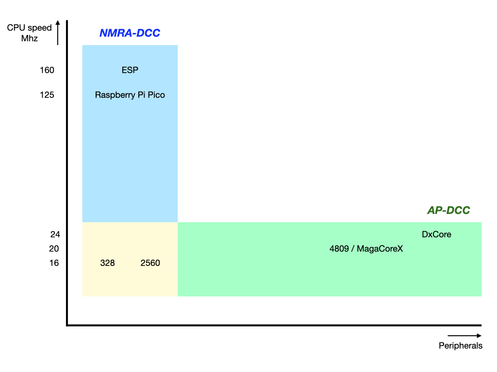

# History and Motivation #

This software is a further development of OpenDecoder 2, as developed by W. Kufer. It has been rewritten, such that it can be used for Arduino (Atmel AVR) environments. From a functional point of view, this code is comparable to the NMRA-DCC library. It has been tested on "standard" Arduino boards (UNO, Nano, Mega) as well as older processors, such as the ATMega16 (MegaCore)). A major difference, however, is that this library is more reliable and efficient on newer ATMega processors, such as the 4809 (Arduino Nano Every, MegaCoreX) and the AVR128DA (DxCore). These processors are not only quite powerful, but they are also cheaper than traditional ATMega microcontrollers. We therefore may expect  in the near future that more Do It Yourself decoder projects that use these new chips.

### Comparison to the NmraDcc library ###
The NmraDcc library does a great job in supporting people to implement their own DCC decoders. Not only offers the NmraDcc library nearly every possible DCC decoding feature someone may want, but also the support to people that need help is great.
So why this new library? In fact there are two reasons.

#### 1. Performance on new ATMega processors ####
The NmraDcc library takes a rather "brute-force" approach to decode the DCC signal, in the sense that it relies on CPU speed but doesn't do a great job when it comes to the exploitation of hardware peripherals that can be found on modern ATMega processors. In fact, as shown in the figure below, we witness a development in which faster boards appear on the market than traditional ATMega Arduino boards. Good examples are the Raspberry Pi Pico (running at 125Mhz) and the ESP-32 (running at 160Mhz). However, we also see a development where (slightly faster) newer ATMega processors appear, such as MegaCoreX and DxCore processors, but with additional and  powerful features. Interesting new features for decoding DCC signals include an Event system, more and better timers, and noise cancelation capabilities.

A nice advantage of the NmraDcc library is that it can be used on traditional ATMega boards (UNO, Nano, Mega), on boards with new ATMega 4809 processor (Nano Every), as well as raspberry Pi Pico and ESP-32 boards. The usage of this library is limited to ATMega processors, but it takes advantage of the new peripherals that can be found in the new ATMega processors. As a result, performance and reliability on these newer ATMega processors is superior compared to the NmraDcc lib.
See [Performance on MegaCoreX and DxCore microcontrollers](Performance_MegacoreX.md) for details on the performance differences while using these processors.

#### 2. Code readability ####
As someone who has been teaching computer science students for years, the lack of structure and the long NmraDcc source file gives, in my opinion, "room for improvement". In fact, the current monolithic structure left me with the impression that making contributions to this libraries will be very hard.

Still my hope is that some of the ideas implemented in this library will inspire others to make such improvement to the NmraDcc library.

### Technical differences ###
Like the original OpenDecoder 2 Software (and version 1.2 of the NmraDcc library), but in contrast to version 2 of the NmraDcc library, this code uses a separate Timer (Timer2 or TCBx) to decode the DCC signal. The advantage of this  is that the need to use the expensive (in CPU cycles) Arduino `micros()` function no longer exists. This decision makes this library more efficient.

In addition, the TCB timers on new ATMega processors can be used in new modes that allow very precise measurements of the length of the DCC input signal. This library therefore satisfies the bit-time requirements as defined in Section 5 of RCN 210: [http://normen.railcommunity.de/RCN-210.pdf](http://normen.railcommunity.de/RCN-210.pdf), and should be usable in multi-protocol environments.

Another important difference is that on new ATMega processors this library takes advantage of the Event System. As a consequence, the expensive (especially on new ATMega processors) `attachInterrupt()` can be avoided and some noise cancelation features help in the removal of spikes.

### Acknowledgements ###
I would like to acknowledge the ideas and feedback obtained from members of the OpenDCC forum, in particular Frank Schumacher and Wolfgang Kufer.
For the discussion, see:
[https://forum.opendcc.de/viewtopic.php?f=17&t=8141](https://forum.opendcc.de/viewtopic.php?f=17&t=8141)
