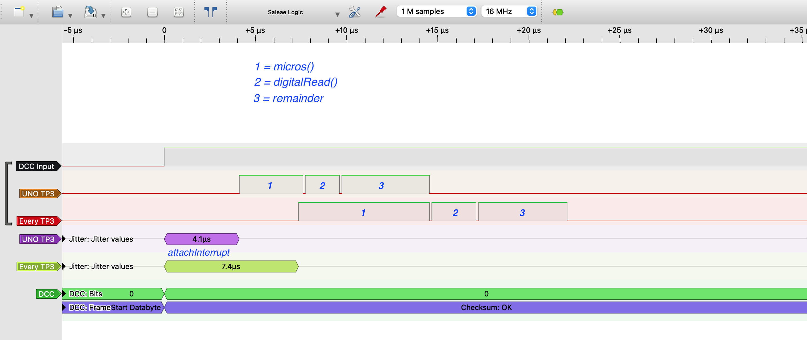
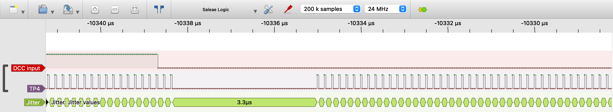

# Performance on MegaCoreX and DxCore #

In recent years Microchip has introduced a number of new ATmega processors. Examples include:
- ATMega 4808: used on the Nano Thinary, a cheap clone available via AliExpress.
- ATMega 4809: used on the Nano Every. This is a cheaper, but also significantly more powerful board then the traditional Nano. The Nano Every is recommended for people who want to start a new decoder board.
- AVR DA-series and DB-series. Examples include the AVR128DA48 and AVR128DB48.

Although the Nano Every board is supported by Arduino as part of the megaAVR, their real power is released when using the ***[MegaCoreX board](https://github.com/MCUdude/MegaCoreX)***. Further information regarding the AVR DA-series and DB-series can be found on the site for the ***[DxCore boards](https://github.com/SpenceKonde/DxCore)***.

## Comparison to traditional ATmega processors ##
For a DCC decoder, where reactions within several (tenths of) microseconds is important, a significant change compared to the traditional ATmega processors (such as the 328P on the Uno and Nano, or 2560 on the Mega) is the modified interrupt structure. Traditional ATmega processors have a limited number of "real hardware interrupt" pins, each associated with their own ISR vector and thus routine. This makes traditional  processors relatively fast.
The newer (MegaCoreX and DxCore) processors, share for all pins connected to a certain port a single ISR vector and routine. Therefore the attachInterrupt() Arduino call has to do extra work to determine to which pin the interrupt belongs, and thus which routine to call to handle the user specific part of the interrupt routine. The overhead of attachInterrupt() on the novel (16Mhz) Nano Every board is roughly twice that of a traditional (16Mhz) UNO board. A good explanation can be found on the [DxCore Github site](https://github.com/SpenceKonde/DxCore/blob/master/megaavr/extras/PinInterrupts.md).

#### Interrupt Performance ####
This difference in attachInterrupt() performance is illustrated in the figure below, which shows some measurements using the [NmraDcc library](https://github.com/mrrwa/NmraDcc). What can be seen is that the UNO takes roughly 15 microseconds to capture and analyse the DCC input signal, whereas the Nano Every takes around 22 microseconds. The overhead of attachInterrupt() is 4,1 (UNO) versus 7,4 (Every) microseconds. But also the "micros() part" is relatively expensive: 3,5 (UNO) versus 7,2 (Every) microseconds. The digitalRead() takes roughly 2 (UNO) versus 2,4 (Every) microseconds. The remaining code is, as can be expected, for UNO and Every roughly the same (4,9 microseconds).

Another change with the new (MegaCoreX and DxCore) processors is that they no longer support nested interrupts, but instead allow a (limited) interrupt hierarchy. The lack of nested interrupts can be problematic for relative long Interrupt Service Routines (in existing libraries).

#### Event System ####
Although attachInterrupt() (and micros()) is considerably slower on MegaCoreX and DxCore processors, these new processors also include a number of new peripherals that allow much faster and far more precise DCC decoding. The most important new peripheral is the event system, which allows us to directly connect the DCC input pin to a timer. Whenever the DCC input signal changes, the timer is immediately (re)started, without any involvement of the CPU (or an ISR). In addition, the improved timers have novel functions, such as 'Capture Frequency Measurement Mode'. In this mode an event triggers the timer to capture the time since the previous event and store this time in a special register. The timer ISR analyses this time to determine if a zero or 1 is received.

Using the event system and the 'Capture Frequency Measurement Mode' it becomes possible to measure the DCC signal with high precision and build decoders that conform to the RCN-210 bit timing standards.

The figure below shows the timer ISR that determines the value of the DCC input signal, and assembles the DCC packet from the received bits. As can be seen, this ISR takes between 3 and 4 microseconds (on a 24Mhz AVR 128DA48), whih is a huge performance improvement compared to traditional approaches, such as used by the NmraDcc library.

