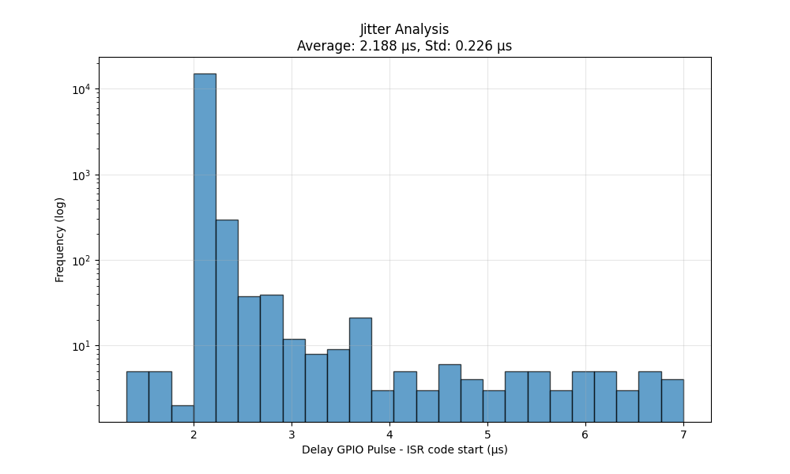

# ESP32 Driver (`ESP32.h`)

## Purpose
The *ESP32* driver implements DCC signal reception using only standard Arduino functions and the ESP-IDF high-resolution timer (`esp_timer_get_time`).
It is derived from the **Generic** driver, but adapted for the ESP32 platform.
The driver measures **full bit times** (rising or falling edges), making it portable but not suitable for precise RCN-210 half-bit timing.

## Operating Principle
- Uses a **single GPIO interrupt** triggered on either a rising **or** falling edge.
- On each edge:
  1. The time since the previous edge is measured with `esp_timer_get_time()` (1 µs resolution).
  2. The measured interval is classified as a **1-bit**, **0-bit**, or error.
  3. If a polarity mismatch is detected, the ISR automatically switches to the opposite edge.
- Margins are applied to account for ISR latency and measurement inaccuracy.
- Polarity handling ensures the decoder can resynchronise if the initial edge choice is wrong.

## Data Flow
1. GPIO interrupt occurs on a DCC signal edge.
2. ISR measures the time difference from the previous edge.
3. Bit value (`DccBitVal`) is determined based on timing thresholds.
4. `sup_isr_assemble_packet.h` assembles bits into a temporary packet buffer (`dccrec.tempMessage`).
5. When a packet is complete:
   - It is copied to `dccMessage.data`.
   - `dccMessage.isReady` is set.

## Hardware Requirements
- **MCU**: ESP32 (all variants with Arduino core support).
- **Pin**: Any GPIO capable of generating an interrupt.
- **Timer**: None dedicated — uses the ESP-IDF system timer.
- Optional: ACK output pin for Service Mode.

## Software Requirements (board definitions)
- [Arduino-ESP32 core](https://github.com/espressif/arduino-esp32)

## Advantages over Generic Driver
- Uses ESP32’s 1 µs resolution system timer for better precision than `micros()`.
- Fully portable within the ESP32 family without peripheral-specific code.

## Limitations
- **Half-bit capture not supported** — cannot meet strict RCN-210 requirements.
- Timing still subject to ISR latency and FreeRTOS scheduling jitter.
- RailCom detection not implemented.
- Zero-bit stretching not implemented.

---
# Design Considerations

### 1) IRAM_ATTR and Stability
On the ESP32, ISRs can be placed either in **flash** or in **IRAM** (Instruction RAM).  
Using `IRAM_ATTR` forces the compiler to place the ISR in IRAM, ensuring it remains accessible even when flash access is temporarily disabled — for example, during flash writes, Wi-Fi operations, or SPI bus contention.

In early benchmarks, the ISR without `IRAM_ATTR` appeared **slightly faster**, because fetching instructions directly from flash (instead of IRAM) can be marginally quicker in some cases due to caching. However, this comes with a serious **stability risk**:  
- If the flash cache is disabled at the exact moment the interrupt fires, execution will stall or crash.  
- Such events are rare in simple sketches but more likely when Wi-Fi, Bluetooth, or other flash-heavy operations are running.

#### *Takeaway:*  
*Always use `IRAM_ATTR` for ESP32 ISRs that must be *safe*.  
The tiny performance difference (~0.1–0.2 µs in entry time) is not worth the potential for random lockups or missed interrupts.*

---

### 2) attachInterrupt()
Initial tests on the ESP32 showed that **Arduino’s `attachInterrupt()`** has a measurable delay before and after executing user ISR code:

- **Entry latency:** ~2.3 µs before ISR code starts.  
- **Exit latency:** ~1.6 µs to return from ISR.  
- **Total overhead:** ~3.9 µs per interrupt.

For a dual-core 240 MHz processor, this is *disappointingly high*, although *acceptable* for a DCC decoder.

Since the DCC input pin is fixed at compile time, several lower-level alternatives from the ESP-IDF were explored in an (failed) attempt to reduce this overhead:

| Method                           | Entry Latency | Exit Latency | Compatibility | Complexity | Notes |
|----------------------------------|--------------:|-------------:|--------------|------------|-------|
| **`attachInterrupt()` (Arduino)**| ~2.3 µs       | ~1.6 µs      | Full         | Low        | Acceptable |
| **`gpio_isr_handler_add()`**     | ~2.6 µs       | ~2.5 µs      | High         | Medium     |  |
| **`esp_intr_alloc()` (direct)**  | ~2.7 µs       | ~2.5 µs      | Limited      | High       | Risk of instability |

**Why lower-level APIs didn’t help:**  
- All methods still pay the same **context save/restore** cost on ISR entry/exit.  
- ESP32 saves many CPU registers even for level-1 interrupts, especially under FreeRTOS.  
- `gpio_isr_handler_add()` routes GPIOs through a **shared interrupt service** (dispatcher), adding extra call layers and overhead.  
- Direct `esp_intr_alloc()` is more complex. It introduced instability in combination with other calls, and in practice was slower than Arduino’s default.

#### *Takeaway:*
*On ESP32, Arduino’s `attachInterrupt()` is already very close to the fastest safe method available.  
For most applications — including DCC — the extra complexity of lower-level APIs is not worth the marginal (or negative) performance difference.*

---

### 3) Timing Resolution and `micros()`
This driver measures DCC edge timing using the ESP-IDF function `esp_timer_get_time()` instead of Arduino’s `micros()`.

#### Why not use `micros()`?
- **Arduino `micros()`** has a fixed resolution of **4 µs**.  
  For DCC decoding, this means on average a ±2 µs uncertainty per edge measurement. Over a full bit, that can add up to ±4 µs (worst-case: ±8 µs)— with implications for precise RCN-210 compliance and RailCom implementation.

`esp_timer_get_time()` has **1 µs resolution** — four times finer than `micros()`.

#### Trade-offs
- Higher function call overhead: `esp_timer_get_time()` typically ~3–6 µs, whereas `micros()` is ~1.5–2 µs.
- Still subject to normal ISR entry/exit latency on ESP32 (typically ~2.3 µs in, ~1.6 µs out with `attachInterrupt()`).
- Resolution is adequate for full-bit timing, but not as precise as hardware capture peripherals.

#### Practical Impact in This Driver
- The driver measures **full DCC bits** (rising-to-rising or falling-to-falling edges), not half-bits.
- At 1 µs resolution, bit classification is robust for both `1` and `0` bits under normal conditions.
- For **future RailCom support** or exact half-bit measurement, a hardware method like **RMT capture** could, in theory, reduce jitter and improve precision (see below).

#### *Takeaway:*  
*Using `esp_timer_get_time()` inside the ISR provides better precision than `micros()` while keeping the code simple and portable across ESP32 variants.*

---

### 4) ISR Trigger Jitter on ESP32

On various forums, it is often mentioned that there can be a significant delay between a **GPIO pin change** and the start of the corresponding **ISR** on the ESP32.  This delay is caused by several factors, including:  
- **FreeRTOS task scheduling** and interrupt priorities.  
- **Wi-Fi / Bluetooth activity**, which can temporarily mask interrupts or delay servicing.  
- Internal interrupt dispatching overhead in the ESP-IDF GPIO driver.  

Published figures online typically range from a few microseconds to several tens of microseconds, but **detailed measurement data is scarce**.

#### Our Measurement Setup
To quantify this for our specific DCC decoding application, we did the following:
- Generated a controlled GPIO pulse and attached an ISR.
- Measured the delay between the GPIO edge and the first instruction inside the ISR.
- Captured signals with a **logic analyzer** and **PulseView**.
- Post-processed several minutes of data using a Python analysis script.

  
#### Results

- **Average delay:** 2.188 µs  
- **Standard deviation:** 0.226 µs  
- **Maximum observed delay:** ~7.0 µs  
- Most interrupts start within 2–3 µs of the GPIO change, with occasional longer delays.
- Notably, occasional sub-2 µs values occur, likely due to cache hits or the CPU already being in the interrupt context.

#### *Takeaway:*
*1. The chosen **margin of 10 µs** in the ESP32 driver should be sufficient, provided we use `esp_timer_get_time()` instead of `micros()`.*  
*2. The jitter is likely acceptable for **reliable RailCom implementation**.*

---

### 5) RMT (Remote Control Peripheral)
RMT is a powerful peripheral on the ESP32, in principle ideal for low-jitter, hardware-timed capture of DCC edge durations. With RMT, it should be possible to meet the strict timing requirements of RCN-210, and solve the limitations mentioned above.

Some initial code was written for an RMT-based DCC decoder. However, **decoding** DCC is significantly more complex than **encoding** it.  
With DCC encoding, a bit sequence can be translated into DCC half-bits and the RMT peripheral handles the precise timing of the output signal. In contrast, DCC decoding requires not only measuring the exact duration of each received half-bit (done by the RMT hardware), but also requires an ISR to determine the precise moment the second half-bit is received — a critical moment for initiating RailCom feedback.

The RMT peripheral delivers timing data as packed items — typically containing two durations per item. However:
- The driver API varies between ESP32 core/IDF versions and SoC variants.
- Using RMT within an ISR context requires strict adherence to ISR-safe coding practices.

#### What RMT gives
- Hardware timestamps of consecutive signal levels (high/low) with tick resolution set by `clk_div`.
- Captured data exposed as `rmt_item32_t` items in a ring buffer (DMA style) — low CPU overhead and very stable timing.
- Typical use: configure RX channel, read `rmt_item32_t` data and convert durations to microseconds.

#### RMT APIs
Although the RMT peripheral itself measures DCC half-bit durations with excellent precision — fully compliant with RCN-210 timing requirements — the **high-level RMT APIs** in ESP-IDF are not suitable for RailCom-capable decoders.  
These APIs deliver captured data via an internal **ring buffer**, only releasing items when the buffer is sufficiently filled. This buffering introduces an **unpredictable delay** between the actual signal transition and the moment the software can process it.  

For RailCom, this delay is unacceptable:  
- The decoder must know **immediately** when the **second half-bit** of a DCC bit is received.  
- This instant marks the start of a RailCom timer.  
- Any delay here will shift the RailCom transmission start, causing collisions or missed feedback.  

To meet this requirement, the driver must use **low-level RMT access** that bypasses the buffered API and provides direct, immediate visibility of captured half-bits as they arrive. This comes with challenges, however:
- **ESP-IDF v4.x**: all TX and RX functions are in `driver/rmt.h`.  
- **ESP-IDF v5.x**: split into `driver/rmt_common.h`, `driver/rmt_rx.h` and `driver/rmt_tx.h`.
- Register layouts and function calls differ between the original ESP32 and newer ESP32-S2/S3/C3 series — requiring chip-specific handling.

#### How RMT presents data
A typical `rmt_item32_t` contains:
- `duration0` : ticks for the first level
- `level0`    : level for `duration0`
- `duration1` : ticks for the second level
- `level1`    : level for `duration1`

Received data always arrives in **pairs**. The decoder must ensure that each pair represents a complete DCC bit (both half-bits). If the first duration belongs to one bit and the second to the next, the capture is misaligned. In this case, the RMT must be restarted to re-align — a process that is non-trivial and can lead to race conditions if not handled carefully.

#### *Takeaway:*
*RMT offers the precision needed for half-bit capture and RailCom timing, but implementing a robust decoder is non-trivial.  
Differences between ESP32 variants and ESP-IDF versions mean that a generic, portable RMT-based decoder requires multiple code paths and careful synchronization logic.*

---

## Conclusion

The ESP32, with its dual cores and 240 MHz clock, offers impressive raw processing power, but its available peripherals are not ideally suited for accurate DCC decoding.  
While bit-time measurement using a GPIO ISR and `esp_timer_get_time()` is certainly possible, the precision is inherently limited by ISR latency, FreeRTOS scheduling, and the 1 µs resolution of the system timer.

Preliminary testing suggests that RailCom implementation should be feasible within these constraints.

An RMT-based approach could, in theory, deliver the precision required by RCN-210, but practical implementation is complicated by differences between ESP-IDF versions and ESP32 family members, requiring multiple code bases — a complexity that, for now, outweighs the benefits.

By contrast, DxCore-based processors, despite having only a single core and one-tenth the clock speed, offer simpler, more predictable timing behavior and are inherently better suited to DCC decoding.  
For most applications without Wi-Fi requirements, the DxCore (and other) MCUs remain the superior choice. The ESP32 becomes most attractive when Wi-Fi (or Bluetooth) connectivity is essential, making it worth the trade-off in timing accuracy.
