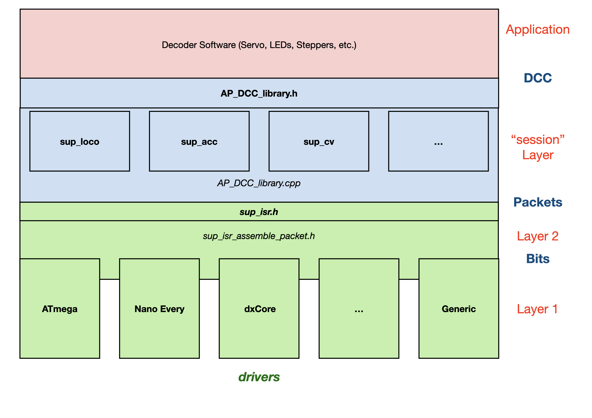
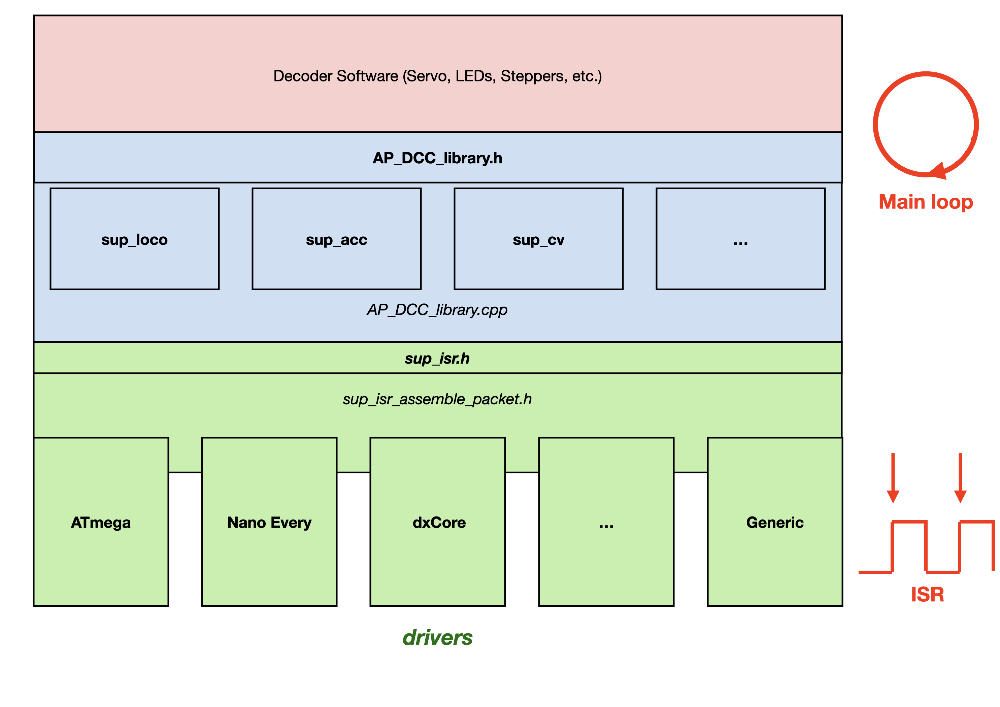

# Library modules #

The library consists of several modules, and their structure will be explained below.

### Functionality ###
The functionality of the various modules resemble the layers that we know from  Reference Models for networks, such as the TCP/IP and OSI models.

At the top (in red), there is the application program. It uses the DCC packets that are delivered by this library to perform decoder specific tasks, such as  a loco decoder turning a motor, or an accessory decoder moving a servos or stepper.

The blue part of the figure consists of the files `AP_DCC_library`, `sup_loco`, `sup_acc` and `sup_cv`. Its functionality may be compared to the session / presentation layer of the OSI model. It provides to the application program all DCC information that may be needed to operate loco decoders, accessory decoders or to proces configuration variables (CVs). Such information is presented to the application program via loco (`sup_loco`), accessory (`sup_acc`) and/or cv (`sup_cv`) objects, which are defined (as C++ classes) within the file `AP_DCC_library.h`. The prefix 'sub' is an abbreviation for 'support', which means that the application program doesn't need to use these file directly.

To perform its tasks, the AP_DCC_library.cpp module analyses the contents of the raw DCC packets that it receives from the green modules below.  It checks if the address contained in the DCC packet matches the decoder's address.; if these addresses don't match, the packet is discarded by this blue part. If the addresses match and the packet is a loco command, it extracts the speed, direction and/or functions from that packet, and make such information available via the loco object. If the packet is an accessory command, it extracts the desired output (switch) and position, and makes this available via the accessory object. In fact, everything that relates to the ***contents*** of the DCC packet is handled by this blue part.   

The green part of the figure consists of the files `sup_isr`, `sup_isr_assemble_packet.h` and a couple of so-called driver files (`Mega.h`, `Nano_Every.h`, `MegaCoreX_DxCore.h` and `Generic.h`).

The functionality of `sup_isr` and `sup_isr_assemble_packet.h` is comparable to the datalink (layer 2) of the OSI model. It delivers to its user (the blue part) valid DCC packets, which it assembles from bits that it receives from the underlying drivers. In network terms, it performs 'framing and delimiting'.

The functionality of the drivers is comparable to that of the OSI physical layer (layer 1). It offers to its user (`sup_isr_assemble_packet.h`) a single bit. For that purpose it measures on the wires the length of each individual DCC pulse, to determine if the DCC signal represents a logical 0 or 1. Depending on the  microcontroller being used, different approaches may be taken to measure pulse duration. For each approach a separate driver exists.

There is a generic driver (`Generic.h`) that runs on all possible microcontrollers. For that purpose it refrains from using any specific peripheral that a microcontroller may offer. In contrast, it uses standard Arduino calls only, such as `attachInterrupt()` and `micros()`. The downside of this approach is that the performance of this driver may be suboptimal (see below).

To get the best possible decoding results, it is necessary to use some of the powerful peripherals that modern microcontrollers may offer. Many of such controllers implement timers that are able to measure the duration of DCC pulses with a precision of 1 microsecond or better. These measurements are performed in hardware, without CPU involvement. With some processors the Event or similar system triggers the timer directly, again without CPU intervention. This gives very precise pulse duration measurement. To compare, the Arduino `micros()` function, as used by the generic driver, has a resolution of 4 μs. Measuring the length of a DCC pulse involves a comparison between two `micros()` function calls, leading to a possible error of 8 μs. Even worse, calls to `attachInterrupt()` have substantial overhead (depending on the microcontroller being used), and may even be delayed if other interrupts occur simultaneously. As a consequence, the measurements of DCC pulse length as performed by the `Generic.h` driver may in practice be sufficient, but will most likely not satisfy the stringent requirements of the DCC standards. Transmission of RailCom messages may not be reliably possible with this driver.

Currently the following drivers have been implemented (more may follow):
- `Mega.h`: this is a driver for traditional ATMega processors, such as the ATMega 328 (UNO, NANO) and ATMega 2560(Mega). Instead of the `micros()` function, it uses one of the timers that traditional ATMega processors offer.
- `MegaCoreX_DxCore.h`: this is a highly optimised driver for modern AVR processors. It requires that the MegaCoreX \ DxCore board package is installed
- `Nano_Every.h`: a driver for the Nano-Every that may be used without the MegaCoreX board package.

### When called? ###
The library files in the blue blocks are used by the program's main loop. How frequent these are called, depends on the other functions the main loop  performs, and off course on the processor's speed.

The files in the green blocks are triggered by DCC interrupts. These interrupts occur every (roughly) 60 to 120 μs. They perform time critical functions, such as the reception of DCC bits and the assembly of these bits into DCC packets.

